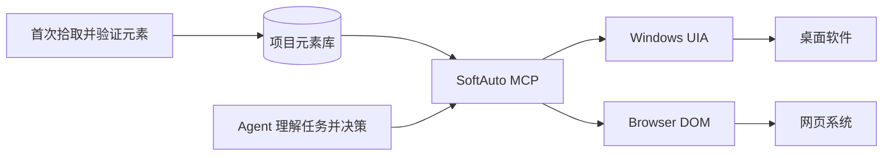

<p align="center">
  
</p>

<h1 align="center">零禾一智能 SoftAuto — Windows RPA + MCP 软件自动化</h1>

<p align="center">
  <strong>开源 Windows RPA、桌面 UI Automation、网页自动化与 MCP Server</strong><br>
  面向 AI Agent 的元素级软件自动化：Computer Use 负责看懂，SoftAuto 负责高速、稳定地执行。
</p>

<p align="center">
  <a href="https://github.com/guangfubill-crypto/SoftAuto-MCP/actions/workflows/ci.yml"></a>
  <a href="https://github.com/guangfubill-crypto/SoftAuto-MCP/releases/latest"></a>
  
  <a href="LICENSE"></a>
</p>

<p align="center">
  <a href="https://github.com/guangfubill-crypto/SoftAuto-MCP/releases/latest"><strong>下载 Windows 安装包</strong></a>
  · <a href="README_EN.md">English</a>
  · <a href="#五分钟上手">快速开始</a>
</p>

<p align="center">
  
</p>

## SoftAuto 是什么

SoftAuto 是一个面向 AI Agent 的开源 Windows RPA 和 MCP Server。它通过 Microsoft UI Automation（UIA）定位桌面软件元素，通过 Chrome DOM 定位网页元素，再把点击、输入、读取、高亮和验证等操作暴露为 Model Context Protocol（MCP）工具。适用于 ERP 自动化、桌面软件自动化、网页业务系统自动化、GUI 测试和重复办公流程。

它不是另一个依赖截图与坐标的宏工具，而是 Computer Use 的确定性执行层：元素只需拾取和验证一次，Agent 后续即可按名称调用，减少重复截图、视觉推理和坐标点击。

## 解决的核心痛点

Computer Use 可以操作几乎所有软件，但如果每一步都经历“截图 → 视觉推理 → 坐标点击 → 再截图”，流程会慢，而且容易受到窗口移动、分辨率和界面变化影响。

SoftAuto 把这条执行链拆开：首次由人像使用 RPA 一样拾取、验证并保存元素；之后 Agent 通过 MCP 直接按元素名称调用 Windows UIA 或浏览器 DOM 动作。智能体继续负责理解和决策，重复的软件操作则走确定性的元素自动化路径。

| | 传统 Computer Use | SoftAuto + MCP |
|---|---|---|
| 定位方式 | 每一步重新看截图、推断坐标 | 复用已验证的 UIA/DOM Locator |
| 执行路径 | 视觉模型 → 坐标操作 | Agent → MCP → 元素原生动作 |
| 窗口移动 | 坐标可能失效 | 重新解析稳定元素属性 |
| 动态文本 | 需要重新识别 | 通配符、前缀与 MCP 变量 |
| 适用场景 | 未知界面、探索性任务 | ERP、业务系统和高频确定性流程 |



## 主要能力

- `Ctrl + 左键`拾取并高亮桌面或网页元素，按项目和文件夹管理元素库。
- 系统推荐稳定属性，也可以编辑属性值、通配符和 `${variable}` 动态变量；`ProcessId` 与 `NativeWindowHandle` 仅用于诊断，不可作为定位条件。
- 重新打开或移动窗口后，依然可以按窗口锚点、控件路径和目标特征重新定位。
- MCP 提供 19 个查询与动作工具，包括查找、高亮、点击、输入、聚焦和读取。
- Windows UIA 与浏览器 DOM 双通道；桌面采集失败时自动调用内置 FlaUI Bridge（UIA3 → UIA2）回退；网页扩展可以从软件内一键打开安装流程。
- 项目元素库可以导入、导出并迁移到其他 Windows 电脑。
- 简体中文 / English 即时切换；界面适配分辨率和 Windows DPI。
- 不提供任意命令执行，也不允许 MCP 绕过元素库随意用坐标点击。

## 五分钟上手

### 安装版（推荐）

1. 从 [Releases](https://github.com/guangfubill-crypto/SoftAuto-MCP/releases/latest) 下载 `Lingheyi-SoftAuto-Setup-*.exe`。
2. 安装并打开 SoftAuto，新建项目和文件夹。
3. 点击“拾取桌面元素”或“拾取网页元素”，移动到目标控件后按 `Ctrl + 左键`保存。
4. 在右侧调整定位属性并点击“验证”。
5. 点击“MCP 配置”，把已复制的配置粘贴到支持 MCP 的 Agent 中。

### 从源码运行

```powershell
uv sync --extra dev
uv run softauto-inspector
```

操作流程：

1. 顶部选择当前项目；点击“新建项目”会创建一个完全独立的空元素库。
2. 首次使用网页模式时点击“安装网页扩展”；软件会打开 Chrome 扩展页、打开扩展目录并复制路径。按提示打开开发者模式，选择“加载已解压的扩展程序”。
3. 点击“新建文件夹”建立应用、页面、模块等层级；可继续在文件夹中建立子文件夹。
4. 选中目标文件夹，点击“拾取桌面元素”或“拾取网页元素”。
5. 移动鼠标，目标元素会显示橙色实时边框。
6. 按 `Ctrl + 鼠标左键`，点击会被拦截，不会传给目标软件。
7. 输入自定义名称并保存到当前文件夹。
8. 在元素库选择元素后，直接在右侧“元素详情”勾选参与定位的属性。
9. 系统会预选带 `★` 的稳定属性。动态文本默认选择 `NamePrefix`，不会选择包含业务值的完整 `Name`；用户可自行增删属性并点击“保存属性”或“验证”。
10. 在元素库中选中元素，点击“验证”，系统会重新定位并高亮元素。
11. 文件夹和元素都可以双击重命名，也可以直接拖放到其他文件夹；非空文件夹不会被误删。
12. 点击“导出项目”生成便携 JSON；另一台电脑安装 SoftAuto 后点击“导入项目”即可迁移全部文件夹、元素和定位器。
13. 点击“复制 MCP 配置”获得已安装 `SoftAutoMCP.exe` 的完整 Agent 配置。

项目注册表保存在 `data/projects.json`，每个项目的元素库独立保存在 `data/projects/<项目ID>/elements.json`。旧版 `data/elements.json` 会复制到首次创建的“默认项目”，原文件继续保留。MCP 默认跟随拾取器当前项目；也可通过 `SOFTAUTO_ELEMENT_LIBRARY` 指向“导出给 MCP”生成的 JSON。MCP 可以使用稳定 ID、唯一名称或完整路径（例如 `Training System/登录/账号`）获取元素。

属性值可以直接编辑，并支持：

- 通配符：`Please take note of your order reference: *`
- 单字符通配符：`Order ?`
- MCP 变量：`Order reference: ${reference}`

包含 `${reference}` 的 Locator 在调用 `get_element`、`validate_saved_element`、`highlight_element` 或动作工具时，通过 `variables` 传值：

```json
{
  "variables": {
    "reference": "842"
  }
}
```

## 深度检查

普通拾取无法区分复杂控件时，点击“深度检查”，会启动成熟的 FlaUInspect。

```powershell
uv run softauto-flauinspect
```

项目已包含经过 SHA-256 校验的 FlaUInspect 3.1.0 官方 Release。

下载包校验值：`a3e571e783af1cf84661332e5229714b7ac81f908ea44b454e5c1aa0398e20d5`。

## 构建 Windows 安装包

安装 PyInstaller 和 Inno Setup 6 后运行：

```powershell
uv sync --extra packaging
.\packaging\build_installer.ps1
```

构建结果为 `Lingheyi-SoftAuto-Setup-0.5.6.exe`。安装版包含：

- `SoftAuto.exe`：元素拾取器与项目元素库界面。
- `mcp/SoftAutoMCP.exe`：可供 Agent 直接连接的 stdio MCP 服务。
- FlaUInspect：随 GUI 一起安装的深度元素检查工具。
- 零禾一智能 Web Connector：随 GUI 一起安装的 Manifest V3 Chrome 扩展目录。

安装版的用户数据默认保存在 `%LOCALAPPDATA%\SoftAuto\data`，卸载或覆盖升级不会删除项目元素。安装目录内的 `安装与MCP配置.txt` 提供 MCP 配置示例。

## 同时连接完整 MCP 栈

`mcp-stack.json` 已配置：

- 本项目 Windows UIA MCP
- Microsoft Playwright MCP 0.0.79
- Ui.Vision MCP Bridge 1.1.1

把该文件的 `mcpServers` 合并到 Agent 的 MCP 配置即可。Playwright 会直接向 Agent 提供浏览器 Accessibility Snapshot 和操作工具；Ui.Vision 需要先安装浏览器扩展并完成本地配对。

OpenAdapt 需要用户自己的 workflow bundle，因此单独提供 `mcp-openadapt.example.json`，填入 bundle 目录后再合并。

## 单独启动 Windows UIA MCP

只读模式：

```powershell
uv run mcp run src/softauto/server.py:mcp
```

显式允许改变 UI：

```powershell
$env:SOFTAUTO_ALLOW_ACTIONS = "1"
uv run mcp run src/softauto/server.py:mcp
```

MCP 客户端配置：

```json
{
  "mcpServers": {
    "software-automation": {
      "command": "uv",
      "args": [
        "run",
        "--directory",
        "C:/absolute/path/to/software-automation-mcp",
        "mcp",
        "run",
        "src/softauto/server.py:mcp"
      ]
    }
  }
}
```

## MCP 工具

只读工具：

- `automation_status`
- `integration_catalog`
- `list_saved_elements`
- `list_element_tree`
- `list_element_projects`
- `get_active_element_project`
- `get_saved_element`
- `validate_saved_element`
- `list_windows`
- `inspect_point`
- `get_element`
- `get_children`
- `find_elements`
- `highlight_element`

动作工具：

- `focus_element`
- `click_element`
- `invoke_element`
- `set_element_value`
- `send_element_keys`

动作工具需要服务器以 `SOFTAUTO_ALLOW_ACTIONS=1` 启动；Click、Invoke、SetValue 和 SendKeys 还要求每次调用显式传入 `confirm=true`。

## Locator 示例

```json
{
  "backend": "windows-uia",
  "version": 1,
  "window": {
    "name": "业务系统",
    "class_name": "MainWindow",
    "control_type": "WindowControl"
  },
  "path": [
    {
      "automation_id": "orderPanel",
      "control_type": "PaneControl",
      "sibling_index": 0
    },
    {
      "automation_id": "saveButton",
      "name": "保存",
      "control_type": "ButtonControl",
      "sibling_index": 0
    }
  ],
  "target": {
    "automation_id": "saveButton",
    "name": "保存",
    "control_type": "ButtonControl"
  }
}
```

定位优先使用 `AutomationId`，再结合名称、ClassName、ControlType、FrameworkId 和结构路径。进程 ID 与窗口句柄只作为弱提示，因为软件重启后它们会变化。

## 后端路由原则

Agent 应按这个顺序选择：

1. 浏览器页面：Playwright MCP。
2. Windows 原生软件：Windows UIA MCP，FlaUInspect 用于人工探查。
3. 元素树不可见：Ui.Vision OCR/图像定位。
4. 稳定的重复业务流程：编译为 OpenAdapt workflow，再通过 OpenAdapt Agent MCP 调用。

## 已知边界

标准 Win32、WPF、WinForms、UWP/Electron 的可访问性质量通常较好。以下界面可能无法返回有意义的元素树：

- 自绘 Canvas、DirectX/OpenGL 界面
- 游戏和部分工业软件
- Citrix、RDP 或视频流中的远端应用
- 未实现 Accessibility 的老控件
- 权限高于 Inspector/MCP 进程的软件

这些场景交给已接入的 Ui.Vision/OpenAdapt 后端，不在本项目里重复实现视觉引擎。
