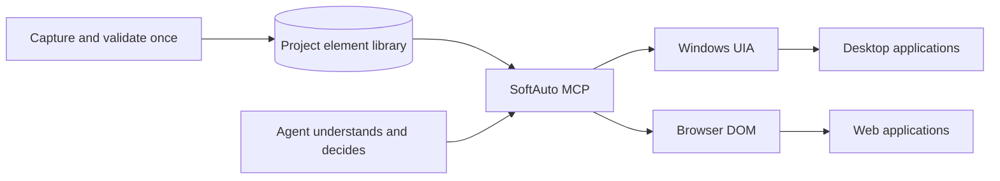

<p align="center">
  
</p>

<h1 align="center">Lingheyi SoftAuto — Open-source Windows RPA & MCP Server</h1>

<p align="center">
  <strong>Desktop UI Automation, Browser Automation, and ERP Automation for AI Agents</strong><br>
  Let Computer Use understand the interface. Let SoftAuto execute it fast and reliably.
</p>

<p align="center">
  <a href="https://github.com/guangfubill-crypto/SoftAuto-MCP/actions/workflows/ci.yml"></a>
  <a href="https://github.com/guangfubill-crypto/SoftAuto-MCP/releases/latest"></a>
  
  <a href="LICENSE"></a>
</p>

<p align="center">
  <a href="https://github.com/guangfubill-crypto/SoftAuto-MCP/releases/latest"><strong>Download for Windows</strong></a>
  · <a href="README.md">简体中文</a>
</p>

<p align="center">
  
</p>

## What is SoftAuto?

SoftAuto is an open-source Windows RPA application and MCP server for AI agents. It locates desktop controls through Microsoft UI Automation (UIA), locates web elements through the Chrome DOM, and exposes click, type, read, highlight, and validation actions as Model Context Protocol (MCP) tools. It is designed for ERP automation, desktop automation, browser automation, GUI testing, and repeatable business workflows.

SoftAuto acts as a deterministic execution layer for Computer Use. Capture and validate an element once, then let an Agent invoke it by name without repeating screenshot analysis and coordinate clicking for every step.

## The problem

Computer Use can operate almost any application, but repeatedly running the loop of screenshot,
visual reasoning, coordinate clicking, and another screenshot is slow and sensitive to window
movement or layout changes.

SoftAuto separates understanding from execution. A person captures and validates an element once.
The Agent can then invoke that named element through MCP, using Windows UIA or browser DOM actions
instead of repeating visual inference for every step.

| | Traditional Computer Use | SoftAuto + MCP |
|---|---|---|
| Targeting | Re-analyze screenshots and coordinates | Reuse a validated UIA/DOM locator |
| Execution | Vision model → coordinate input | Agent → MCP → native element action |
| Window movement | Coordinates may fail | Stable properties are resolved again |
| Dynamic text | Requires another visual pass | Wildcards, prefixes, and MCP variables |
| Best fit | Unknown interfaces and exploration | ERP, line-of-business apps, repeatable workflows |



## Highlights

- Capture and highlight desktop or web elements with `Ctrl + left-click`.
- Organize elements in project-scoped folder trees and move projects between computers.
- Edit recommended locator properties, wildcards, prefixes, and `${variable}` values. Runtime `ProcessId` and `NativeWindowHandle` remain diagnostic-only and cannot be selected for matching.
- Resolve elements again after applications restart or windows move.
- Expose 19 MCP query and action tools, including find, highlight, click, input, focus, and read.
- Use Windows UIA and browser DOM backends from one element library; desktop capture automatically falls back through the bundled FlaUI UIA3 → UIA2 bridge when the primary provider cannot inspect a control.
- Switch between Simplified Chinese and English; responsive UI supports Windows DPI scaling.
- No arbitrary shell execution and no unrestricted coordinate clicking through MCP.

## Quick start

### Windows installer

1. Download `Lingheyi-SoftAuto-Setup-*.exe` from [Releases](https://github.com/guangfubill-crypto/SoftAuto-MCP/releases/latest).
2. Install SoftAuto and create a project and folder.
3. Click **Pick Desktop Element** or **Pick Web Element**, then press `Ctrl + left-click` on the target.
4. Adjust locator properties and click **Validate**.
5. Click **MCP Config** and paste the copied configuration into an MCP-compatible Agent.

### Run from source

Requirements: Windows 10/11 and Python 3.11–3.13.

```powershell
uv sync --extra dev
uv run softauto-inspector
```

Run the MCP server directly:

```powershell
$env:SOFTAUTO_ALLOW_ACTIONS = "1"
uv run mcp run src/softauto/server.py:mcp
```

## MCP configuration

The installed application can copy the exact configuration for the current computer. A typical
configuration looks like this:

```json
{
  "mcpServers": {
    "software-automation": {
      "command": "C:\\Users\\<user>\\AppData\\Local\\Programs\\SoftAuto\\mcp\\SoftAutoMCP.exe"
    }
  }
}
```

MCP follows the project currently selected in SoftAuto. Set `SOFTAUTO_ELEMENT_LIBRARY` when you
want it to use an exported standalone element library instead.

## Development

```powershell
uv sync --frozen --extra dev
uv run ruff check src tests
uv run pytest -q
```

The current release has 36 automated tests. See [CONTRIBUTING.md](CONTRIBUTING.md) before sending a
pull request.

## Security and scope

SoftAuto is designed for systems and accounts you are authorized to automate. Saved locators may
contain application titles, URLs, and control metadata, so review exported libraries before sharing
them. See [SECURITY.md](SECURITY.md) for the action policy and vulnerability reporting process.

## License

SoftAuto's original source code is available under the [MIT License](LICENSE). Bundled and optional
third-party components retain their own licenses; see [THIRD_PARTY_NOTICES.md](THIRD_PARTY_NOTICES.md).
